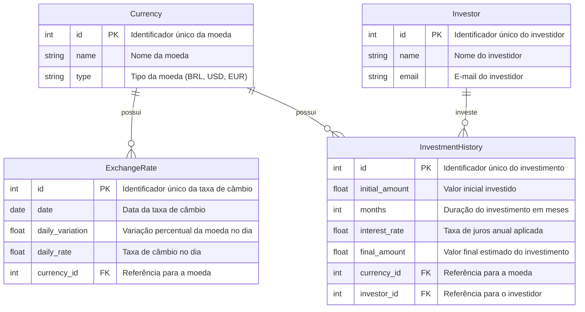

# Giro.Tech - Desafio Técnico Backend

---

## **1. Introdução**

Neste desafio, sua missão será demonstrar sua habilidade em **desenvolvimento de APIs**, criando endpoints **RESTful** para manipulação de dados de forma eficiente e estruturada.

Você trabalhará com um banco de dados relacional e precisará desenvolver endpoints para **inserção, consulta, atualização e remoção** de registros.

---

## **2. Modelo de Banco de Dados**
Aqui está um diagrama representando o esquema das tabelas que você irá manipular.



**Explicação do diagrama:**
- **Currency**: Tabela de moedas disponíveis.
- **ExchangeRate**: Tabela com o histórico diário das taxas de câmbio de cada moeda.
- **InvestmentHistory**: Tabela com o histórico de investimentos.
- **Investor**: Tabela com os dados do investidor.

---

## **3. Desafios da Implementação**
A aplicação deve expor **endpoints REST** para as seguintes operações:

### **3.1. Inserção de Dados**


#### **POST /currencies**  

- Cadastro de uma nova moeda.

##### **Exemplo de Entrada:**  
```json
{
  "name": "Dólar Americano",
  "type": "USD"
}
```
##### **Exemplo de Saída:**  
```json
{
  "id": 1,
  "name": "Dólar Americano",
  "type": "USD"
}
```  
<br>

#### **POST /exchange-rates**
 - Cadatro de uma nova taxa de câmbio.  
##### **Exemplo de Entrada:**  
```json
{
  "date": "2025-02-01",
  "daily_variation": 0.5,
  "daily_rate": 5.25,
  "currency_id": 1
}
```
##### **Exemplo de Saída:**  
```json
{
  "id": 1,
  "date": "2025-02-01",
  "daily_variation": 0.5,
  "daily_rate": 5.25,
  "currency_id": 1
}
```
<br>

#### **POST /investors** 
- Cadastro de um novo investidor.

**regra**: Não deve ser possível cadastrar um investidor com um e-mail já existente. 

##### **Exemplo de Entrada:**  
```json
{
  "name": "João Silva",
  "email": "joao@email.com"
}
```
##### **Exemplo de Saída:**  
```json
{
  "id": 1,
  "name": "João Silva",
  "email": "joao@email.com"
}
```
<br>

#### **POST /investments**
 - Cadastro de um novo investimento.  
##### **Exemplo de Entrada:**  
```json
{
  "initial_amount": 10000,
  "months": 12,
  "interest_rate": 5.5,
  "final_amount": 10550,
  "currency_id": 1,
  "investor_id": 1
}
```
##### **Exemplo de Saída:**  
```json
{
  "id": 1,
  "initial_amount": 10000,
  "months": 12,
  "interest_rate": 5.5,
  "final_amount": 10550,
  "currency_id": 1,
  "investor_id": 1
}
```

---

### **3.2. Consultas**


#### **GET /currencies** 
- Lista todas as moedas cadastradas.
##### **Exemplo de Saída:**  
```json
[
  {
    "id": 1,
    "name": "Dólar Americano",
    "type": "USD"
  },
  {
    "id": 2,
    "name": "Euro",
    "type": "EUR"
  }
]
```
<br>

#### **GET /exchange-rates/recent** 
- Retornar as taxas de câmbio dos últimos 7 dias.
##### **Exemplo de Saída:**  
```json
[
  {
    "id": 1,
    "date": "2025-02-01",
    "daily_variation": 0.5,
    "daily_rate": 5.25,
    "currency_name": "Dólar Americano",
    "currency_type": "USD"
  },
  {
    "id": 2,
    "date": "2025-02-02",
    "daily_variation": -0.3,
    "daily_rate": 5.22,
    "currency_name": "Euro",
    "currency_type": "EUR"
  }
]
```

---

### **3.3. Atualização de Dados**


#### **PUT /exchange-rates/{id}** 
- Atualiza a taxa de câmbio de uma moeda específica.  
##### **Exemplo de Entrada:**  
```json
{
  "daily_variation": 0.8,
  "daily_rate": 5.30,
  "currency_id": 1
}
```
##### **Exemplo de Saída:**  
```json
{
  "id": 1,
  "date": "2025-02-01",
  "daily_variation": 0.8,
  "daily_rate": 5.30
}
```

---

### **3.4. Remoção de Registros**

#### **DELETE /exchange-rates/old** 
- Remover os registros de taxas de câmbio com mais de 30 dias. 

<br>

#### **DELETE /investor/{id}** 
- Deletar um investidor.

**regra:** Se existirem investimentos vinculados ao investidor eles devem ser deletados também.

---

## **Bônus:**

- Implementar **testes unitários/integração**.

